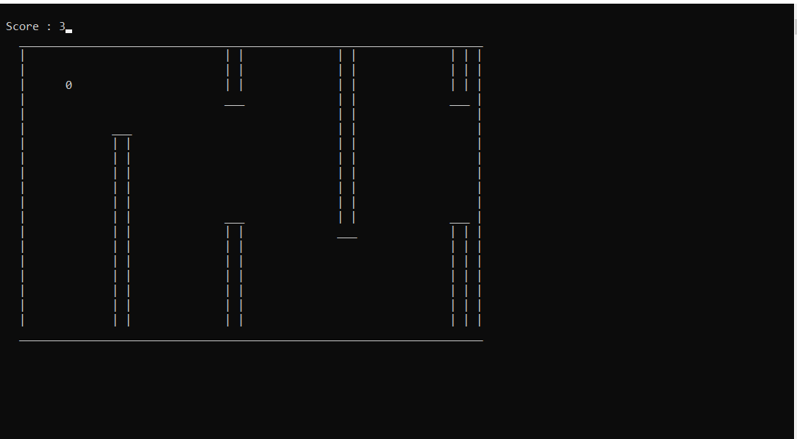

# FlappyBird-c

A simple Flappy bird game built in **2022**. It was developed in **two week** as a fun project.

## Screenshot

## How to Play

- Use the arrow up or the space key to jump.
- Jump through the gaps to survive.
- Avoid colliding with the ground or the ceilling!

## Features

- Classic Flappy Bird gameplay
- Minimalistic graphics
- Simple mechanics

## Technologies Used

- **Language:** C

## Setup

1. Clone the repository
2. Compile the main file and run its executable
